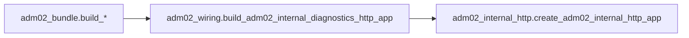

# ADM-02: точка composition и переход на persistence_backing

## Файлы, которые планировалось посмотреть / которые потенциально пришлось бы менять

**Уже просмотрены (релевантная цепочка ADM-02):**

- [backend/src/app/internal_admin/adm02_bundle.py](backend/src/app/internal_admin/adm02_bundle.py) — dataclass’ы зависимостей и три builder’а (`build_adm02_internal_diagnostics_starlette_app*`), в т.ч. `..._with_persistence_backing`.
- [backend/src/app/admin_support/adm02_wiring.py](backend/src/app/admin_support/adm02_wiring.py) — единственная сборка handler + `create_adm02_internal_http_app`.
- [backend/src/app/admin_support/adm02_internal_http.py](backend/src/app/admin_support/adm02_internal_http.py) — фактический `Starlette` + маршрут `ADM02_INTERNAL_DIAGNOSTICS_PATH`.
- [backend/src/app/internal_admin/__init__.py](backend/src/app/internal_admin/__init__.py) — пустой; composition сюда не вынесен.
- [backend/src/app/application/bootstrap.py](backend/src/app/application/bootstrap.py) — slice-1 без internal admin HTTP.
- [backend/src/app/runtime/__init__.py](backend/src/app/runtime/__init__.py) и выборочно [backend/src/app/runtime/telegram_httpx_live_app.py](backend/src/app/runtime/telegram_httpx_live_app.py) — polling/httpx, без Starlette internal admin.

**Потенциально придётся менять / добавить позже (когда появится HTTP/ASGI composition):**

- Первый реальный модуль, где соберут общий ASGI/Starlette и смонтируют internal routes (сейчас в указанных директориях **не найден**; grep по репозиторию не показывает ни одного импорта `adm02_bundle` вне `backend/tests/`).
- Конфиг/секреты для `adm02_allowlisted_internal_admin_principal_ids` (если вынесут из кода) — искать по мере появления HTTP entrypoint’а; в текущем дереве не задействовано.

**Не требуются для «переключения builder’а»** (уже есть оба пути): [backend/src/app/admin_support/adm02_wiring.py](backend/src/app/admin_support/adm02_wiring.py), [backend/src/app/internal_admin/adm02_bundle.py](backend/src/app/internal_admin/adm02_bundle.py) — менять их под переключение не нужно, если только не решат централизовать один публичный factory (не обязательно).

---

## 1. Files inspected

См. список выше; дополнительно: repo-wide grep по `adm02`, `build_adm02`, `adm02_bundle` (весь `d:\TelegramBotVPN`).

---

## 2. Assumptions

- «Production» = то, что реально исполняется из `backend/src/app` и монтирует HTTP; в этом репозитории **нет** такого call-site для ADM-02 (только библиотека + тесты).
- Internal admin HTTP для ADM-01 в prod в этом дереве тоже **не** подключён (grep `create_adm01` / `build_adm01` в `src` пустой); значит internal admin пока **не** часть shipping runtime здесь.
- Безопасное переключение = вызов `build_adm02_internal_diagnostics_starlette_app_with_persistence_backing` с **реальными** экземплярами `BillingEventsLedgerRepository`, `MismatchQuarantineRepository`, `ReconciliationRunsRepository`, персистентным `Adm02FactOfAccessRecordAppender`, согласованным `now_provider`, тем же `Adm01IdentityResolvePort`, allowlist и опционально `Adm02RedactionPort`.

---

## 3. Security risks

- **Высокочувствительные read-пути**: billing / quarantine / reconciliation diagnostics — утечка при слабом redaction или ошибке allowlist.
- **Fact-of-access persistence**: при неверном `now_provider` или appender’е — искажённый аудит; при записи до deny-check — нарушение политики «denied short-circuits» (в коде handler’а это уже покрыто тестами; риск — неправильная интеграция снаружи).
- **Принципал**: `DefaultInternalAdminPrincipalExtractor` доверяет транспортному слою; если HTTP exposed без mTLS/VPN/прокси-аутентификации — риск подмены `internal_admin_principal_id` в теле запроса (архитектурный риск ingress’а, не builder’а).
- **Пустой или широкий allowlist**: fail-open на уровне конфигурации.

---

## 4. Current ADM-02 composition point

**Фактическая цепочка сборки Starlette (единственная в `src`):**

- Публичные entrypoints: [backend/src/app/internal_admin/adm02_bundle.py](backend/src/app/internal_admin/adm02_bundle.py) (`build_adm02_internal_diagnostics_starlette_app` → делегирует в `build_adm02_internal_diagnostics_http_app`).
- Нижележащий builder: [backend/src/app/admin_support/adm02_wiring.py](backend/src/app/admin_support/adm02_wiring.py) — создаёт `Adm02DiagnosticsHandler` и вызывает [backend/src/app/admin_support/adm02_internal_http.py](backend/src/app/admin_support/adm02_internal_http.py) `create_adm02_internal_http_app` с `DefaultInternalAdminPrincipalExtractor`.

**Использование сегодня:** в `backend/src/app` **нет** вызовов `build_adm02_internal_diagnostics_starlette_app` / `..._with_persistence_backing` вне самого `adm02_bundle.py`. **Тесты** ([backend/tests/test_adm02_bundle.py](backend/tests/test_adm02_bundle.py)) вызывают и «тонкий» Starlette-app, и `..._with_persistence_backing`.

**Зависимости уже «в точке» `build_adm02_internal_diagnostics_http_app` (сигнатура wiring):** `identity`, `billing`, `quarantine`, `reconciliation`, `audit`, опционально `redaction`, `adm02_allowlisted_internal_admin_principal_ids`; principal extraction зашит в wiring как default extractor.

---

## 5. Missing pieces / blockers

- **Нет production composition root** для монтирования ADM-02 (и вообще internal Starlette) — нечего «переключить» одной строкой в существующем prod-файле.
- Для `build_adm02_internal_diagnostics_starlette_app_with_persistence_backing` в рантайме должны существовать **конкретные** (не только in-memory из тестов) реализации:
  - `BillingEventsLedgerRepository`
  - `MismatchQuarantineRepository`
  - `ReconciliationRunsRepository`
  - `Adm02FactOfAccessRecordAppender` (персистентный, не только `InMemory...`)
  - `now_provider`
  - `Adm01IdentityResolvePort` (тот же контур, что для ADM-02 identity resolution)
  - опционально `Adm02RedactionPort`
  - allowlist principal id’ов

В [backend/src/app/persistence/](backend/src/app/persistence/) есть Protocol’ы и in-memory реализации; **привязка к prod-хранилищу** в `application/` / `runtime/` **не обнаружена**.

---

## 6. Recommended next smallest code step

**Один маленький кодовый шаг в одном файле невозможен как «замена существующего prod-вызова»** — такого вызова нет.

**Минимальный безопасный следующий шаг после появления HTTP entrypoint’а:** в **одном** новом или существующем composition-модуле (там, где впервые соберут ASGI и зависимости из живого контейнера) вызвать **`build_adm02_internal_diagnostics_starlette_app_with_persistence_backing(Adm02InternalDiagnosticsPersistenceBackedDependencies(...))`**, передав уже созданные в том же composition-root репозитории и appender. Это не дублирует builders и не трогает ADM-01.

Если HTTP entrypoint планируется отдельно от этого репо — переключение делается **там**, импортируя `app.internal_admin.adm02_bundle`.

**Промежуточный helper/adapter не обязателен**: `adm02_bundle` уже адаптирует репозитории к read-port’ам.

---

## 7. Self-check

- Цепочка `bundle → wiring → internal_http` подтверждена чтением файлов и grep.
- В `application/` и `runtime/` нет ссылок на ADM-02 — production wiring отсутствует в scope поиска.
- `build_adm02_internal_diagnostics_starlette_app_with_persistence_backing` уже реализован и покрыт тестами; блокер — **наличие живых зависимостей и одной composition-точки**, а не отсутствие builder’а.
- ADM-01 не затрагивается; новые интерфейсы не требуются для перехода на persistence_backing.
