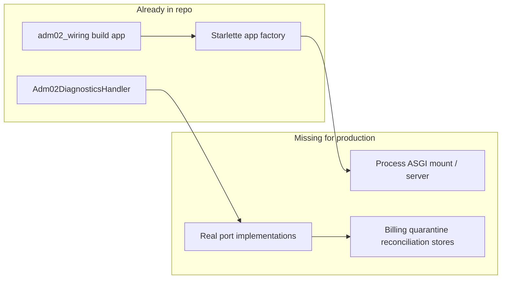

# ADM-02: minimal safe integration (planning only)

## 1. Files inspected

Просмотрены и использованы для выводов:

- [backend/src/app/admin_support/adm02_wiring.py](backend/src/app/admin_support/adm02_wiring.py) — `build_adm02_internal_diagnostics_http_app`
- [backend/src/app/admin_support/adm02_internal_http.py](backend/src/app/admin_support/adm02_internal_http.py) — `create_adm02_internal_http_app`, путь `ADM02_INTERNAL_DIAGNOSTICS_PATH`
- [backend/src/app/admin_support/adm02_endpoint.py](backend/src/app/admin_support/adm02_endpoint.py) — `execute_adm02_endpoint`, доверие к principal
- [backend/src/app/admin_support/adm02_diagnostics.py](backend/src/app/admin_support/adm02_diagnostics.py) — оркестрация handler (начало файла)
- [backend/src/app/admin_support/contracts.py](backend/src/app/admin_support/contracts.py) — все `Adm02*` / `Adm01IdentityResolvePort` и audit
- [backend/src/app/admin_support/principal_extraction.py](backend/src/app/admin_support/principal_extraction.py)
- [backend/src/app/application/bootstrap.py](backend/src/app/application/bootstrap.py) — `Slice1Composition` (Telegram slice, без admin HTTP)
- [backend/src/app/runtime/startup.py](backend/src/app/runtime/startup.py) — `build_slice1_in_memory_runtime_bundle`
- Поиск по `backend/src`: `Starlette|ASGI|uvicorn|mount`, `quarantine|reconciliation|billing`
- [backend/tests/test_adm02_internal_http_composition.py](backend/tests/test_adm02_internal_http_composition.py) — как сегодня собирается HTTP в тестах

## 2. Assumptions

- **A1.** «Production adapters» — это реализации портов из [contracts.py](backend/src/app/admin_support/contracts.py), подключаемые к уже существующему `build_adm02_internal_diagnostics_http_app`, а не новые произвольные интерфейсы.
- **A2.** Следующий coding-step **не** добавляет процессный entrypoint (uvicorn/gunicorn), **не** вешает Starlette на порт и **не** вводит публичный маршрут; internal-only остаётся по пути из `adm02_internal_http` (уже `/internal/admin/...`).
- **A3.** Доверие к `internal_admin_principal_id` в HTTP-слое сегодня завязано на `trusted_source=True` в [adm02_endpoint.py](backend/src/app/admin_support/adm02_endpoint.py); в production предполагается **внешняя** граница доверия (private network / mTLS / sidecar identity), код этой сессии **не переписывается** в этом шаге.
- **A4.** В текущем `backend/src` **нет** таблиц/репозиториев для billing facts, quarantine и reconciliation diagnostics (grep показал только admin_support и комментарии в domain/status); реальные адаптеры появятся вместе с persistence/domain, которых в дереве пока нет.

## 3. Security risks

- **S1. Spoofed internal admin principal** при монтировании HTTP без жёсткой сетевой/mTLS-границы: тело JSON само по себе не аутентифицирует актора; `trusted_source=True` [adm02_endpoint.py](backend/src/app/admin_support/adm02_endpoint.py) означает, что **transport должен быть недоступен** из недоверенных сетей.
- **S2. Утечка чувствительной сводки** (billing category, internal_fact_refs, quarantine/reconciliation markers): даже при allowlist ошибки конфигурации или слабые read-порты увеличивают blast radius.
- **S3. Audit gap / подделка следа**: если `Adm02FactOfAccessAuditPort` не доведён до устойчивого append-only хранилища до включения endpoint в production, нарушается подотчётность.
- **S4. DoS / злоупотребление read path**: без rate limiting и без идемпотентности на уровне ingress внутренний POST может нагружать зависимости (out of scope infra, но риск признать).
- **S5. Смешение с ADM-01**: любой общий mount должен изолировать авторизацию и пути; требование **не трогать ADM-01** снижает риск случайной регрессии, если новый слой не импортирует `adm01`_*.

## 4. Blocker analysis

- **Узкий кандидат на роль composition-точки для ADM-02 internal HTTP уже есть:** функция `build_adm02_internal_diagnostics_http_app` в [adm02_wiring.py](backend/src/app/admin_support/adm02_wiring.py) — это ровно «порты + allowlist + extractor → Starlette», без process lifecycle.
- **Кандидата на единую process-level / multi-surface internal-admin composition в `src` нет:** [bootstrap.py](backend/src/app/application/bootstrap.py) — slice-1 Telegram; [runtime/startup.py](backend/src/app/runtime/startup.py) и соседние модули — polling/live loops, не HTTP root.
- **Минимальный новый слой на следующем шаге (идея, без реализации сейчас):** один небольшой модуль **границы** (например `app/internal_admin/` или `app/composition/internal_admin.py`), ответственность: **именованная структура зависимостей** для ADM-02 (те же типы, что уже принимает `build_adm02_internal_diagnostics_http_app`) + **одна** функция-делегат к существующему `build_adm02_internal_diagnostics_http_app` *или* только типизированный контейнер без вызова — на выбор при реализации; **без** нового app root, **без** изменений ADM-01, **без** фиктивных prod-адаптеров.
- **Production adapters, которые реально понадобятся** (по сигнатуре wiring и [contracts.py](backend/src/app/admin_support/contracts.py)):
  - identity: `Adm01IdentityResolvePort`
  - read: `Adm02BillingFactsReadPort`, `Adm02QuarantineReadPort`, `Adm02ReconciliationReadPort`
  - audit: `Adm02FactOfAccessAuditPort`
  - optional: `Adm02RedactionPort`
  - авторизация уже зашита как `AllowlistAdm02Authorization` в wiring (отдельный «adapter file» не требуется, только конфиг allowlist из env/config позже).

## 5. Recommended next smallest coding step

**Один** узкий PR: добавить модуль границы (например `backend/src/app/internal_admin/adm02_bundle.py`) с:

- frozen `@dataclass` (или эквивалент) `Adm02DiagnosticsDependencies` / `Adm02InternalHttpBundle`: поля — ровно те же порты + `adm02_allowlisted_internal_admin_principal_ids`, что [adm02_wiring.build_adm02_internal_diagnostics_http_app](backend/src/app/admin_support/adm02_wiring.py);
- функция `build_starlette_app(deps) -> Starlette`, которая **только** вызывает существующий `build_adm02_internal_diagnostics_http_app` (без дублирования логики handler/authorization).

Цель: зафиксировать **единую точку импорта** для будущих production-адаптеров и тестов «собрали deps → получили app», не добавляя сервер и не трогая `runtime/`* и ADM-01.

## 6. Acceptance criteria for that next step

- Импорт нового модуля не тянет `app.runtime`, `adm01_`*, uvicorn.
- Поведение идентично прямому вызову `build_adm02_internal_diagnostics_http_app` при тех же аргументах (регрессия: существующие тесты зелёные; при желании — один тест, что `build_starlette_app(deps)` даёт тот же класс маршрутов/путь, что и прямой вызов).
- Нет новых публичных маршрутов и нет нового «корневого» ASGI приложения процесса.
- Нет классов-заглушек, выдающих себя за production billing/quarantine/reconciliation.

## 7. Self-check

- Порядок **adapters / хранилища раньше process mount**: mount без реальных портов и audit либо бесполезен, либо опасен; узкий dataclass+delegate **не** является mount и **не** подменяет адаптеры фикцией — ок.
- ADM-01 не входит в предлагаемый diff.
- Нет ADR/README.
- Ответ содержит ровно запрошенные 7 секций внутри плана.

