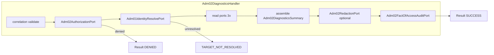

# ADM-02 — smallest safe slice (plan only)

## Опора на артефакты

- Правило [docs/architecture/11-admin-support-and-audit-boundary.md](docs/architecture/11-admin-support-and-audit-boundary.md): ADM-02 = read-only billing/quarantine/reconciliation **diagnostics**; чувствительнее ADM-01; обязателен **minimal append-only fact-of-access audit** (actor, capability class, target scope ref, correlation id, read-only outcome category; без payload и лишнего PII); ops telemetry **не** замена audit для ADM-02.
- Паттерн orchestration: [backend/src/app/admin_support/adm01_lookup.py](backend/src/app/admin_support/adm01_lookup.py) — `require_correlation_id` → authz → identity resolve → параллельные read ports → optional redaction → result.
- Паттерн контрактов: [backend/src/app/admin_support/contracts.py](backend/src/app/admin_support/contracts.py) — frozen dataclasses, узкие `Protocol` порты, отдельный `*AuthorizationPort`, итог `Outcome` + `Result`.
- Authz slice-1: тот же стиль, что [backend/src/app/admin_support/authorization.py](backend/src/app/admin_support/authorization.py) — отдельный allowlist класс **не** смешивать с `AllowlistAdm01Authorization` (избежать over-privilege).

## Минимальные contracts / types / ports (вопрос 1)

**Переиспользовать без дублирования смысла:** `AdminActorRef`, `AdminTargetLookup` / `InternalUserTarget` / `TelegramUserTarget`, `Adm01IdentityResolvePort` (тот же fail-closed resolve internal user id), `RedactionMarker` при необходимости в сводке.

**Добавить (имена ориентировочные):**

| Что                                                  | Назначение                                                                                                                                                                                                                                                                                                                                                                     |
| ---------------------------------------------------- | ------------------------------------------------------------------------------------------------------------------------------------------------------------------------------------------------------------------------------------------------------------------------------------------------------------------------------------------------------------------------------ |
| `Adm02DiagnosticsInput`                              | `actor`, `target: AdminTargetLookup`, `correlation_id` — зеркало `Adm01LookupInput` по форме входа                                                                                                                                                                                                                                                                             |
| Лёгкие summary-типы                                  | Только **категории и внутренние refs как строки** (ledger fact refs, quarantine reason/marker enums, reconciliation run status/summary markers) — без сумм, валют, raw webhook, секретов                                                                                                                                                                                       |
| `Adm02DiagnosticsSummary`                            | Композиция подструктур + `redaction: RedactionMarker`                                                                                                                                                                                                                                                                                                                          |
| `Adm02DiagnosticsOutcome` / `Adm02DiagnosticsResult` | Как ADM-01: `SUCCESS`, `DENIED`, `TARGET_NOT_RESOLVED`, `INVALID_INPUT`, `DEPENDENCY_FAILURE` (+ при необходимости `PARTIAL` только если это отражено в summary, не отдельный «бизнес» смысл)                                                                                                                                                                                  |
| Read `Protocol`s (3 узких)                           | Например `Adm02BillingFactsReadPort`, `Adm02QuarantineReadPort`, `Adm02ReconciliationReadPort` — по одному методу на порт, аргумент `internal_user_id: str`, возврат маленького immutable объекта                                                                                                                                                                              |
| `Adm02AuthorizationPort`                             | `check_adm02_diagnostics_allowed(actor, *, correlation_id) -> bool` — **отдельное** capability от ADM-01                                                                                                                                                                                                                                                                       |
| `Adm02RedactionPort`                                 | `redact_diagnostics_summary(summary) -> summary` (optional в handler, как ADM-01)                                                                                                                                                                                                                                                                                              |
| `Adm02FactOfAccessAuditPort`                         | Один метод: зафиксировать **факт доступа** полями из doc rule: actor id (или `AdminActorRef`), **стабильный capability id** (константа/enum `ADM_02_DIAGNOSTICS`), **scope ref** (минимум `internal_user_id` после resolve), `correlation_id`, **outcome category** нормализованный (например `success` / `partial` при redaction), **без** тела ответа и без расширенного PII |

Никаких HTTP DTO, Starlette, SQL — только application boundary.

## Переиспользование ADM-01 без шума (вопрос 2)

- Тот же **порядок шагов** и обработка исключений портов → `DEPENDENCY_FAILURE`.
- Тот же **identity resolve** порт и типы target/correlation.
- **Не** копировать `adm01_endpoint.py` / internal HTTP в этом шаге.
- **Не** расширять `AllowlistAdm01Authorization` новыми методами — новый класс `AllowlistAdm02Authorization` (или эквивалент) с отдельным набором principal ids.

## Границы: summary / authz / redaction / audit (вопрос 3)

- **Authz:** сразу после валидного `correlation_id`; при `DENIED` — нет вызовов read-портов (как в тестах ADM-01).
- **Diagnostics summary:** только сбор нормализованных структур из read-портов; порты не знают про audit и не пишут «логи».
- **Redaction:** после сборки, до финального результата; маркер redaction отражается в summary.
- **Fact-of-access audit:** только в orchestration; **после** redaction; **не** смешивать с metrics/logging — отдельный `Protocol` (реализация хранилища позже). Для smallest safe slice: вызывать **только при `SUCCESS` с ненулевой сводкой** (факт просмотра чувствительной диагностики). Не записывать полный summary в audit args. При сбое audit-порта трактовать как `DEPENDENCY_FAILURE` и не отдавать summary (fail-closed на утечку без учёта доступа — согласовать в тесте).

## Самый маленький production diff следующего AGENT-шага (вопрос 4)

1. Расширить [backend/src/app/admin_support/contracts.py](backend/src/app/admin_support/contracts.py) блоком ADM-02 (типы + порты).
2. Новый файл [backend/src/app/admin_support/adm02_diagnostics.py](backend/src/app/admin_support/adm02_diagnostics.py) — `Adm02DiagnosticsHandler` по образцу `Adm01LookupHandler`.
3. Расширить [backend/src/app/admin_support/authorization.py](backend/src/app/admin_support/authorization.py) — `AllowlistAdm02Authorization`.
4. Обновить [backend/src/app/admin_support/**init**.py](backend/src/app/admin_support/__init__.py) экспорты для новых публичных символов (минимально, как для ADM-01).

**Вне diff этого шага:** `adm02_endpoint`, internal HTTP, реальные адаптеры read-портов, реализация append storage, RBAC engine, observability.

## Тесты первого шага (вопрос 5)

Новый файл [backend/tests/test_adm02_diagnostics_handler.py](backend/tests/test_adm02_diagnostics_handler.py) по аналогии с [backend/tests/test_adm01_lookup_handler.py](backend/tests/test_adm01_lookup_handler.py):

- Happy path: все read-порты возвращают данные → `SUCCESS`, audit вызван ровно один раз с ожидаемыми полями (capability id, `internal_user_id`, `correlation_id`, outcome category согласован с redaction).
- `DENIED`: read-порты и audit **не** вызываются.
- `INVALID_INPUT` / bad correlation: как ADM-01.
- `TARGET_NOT_RESOLVED`: read-порты не вызываются; audit **не** вызывается (нет факта доступа к диагностике).
- `DEPENDENCY_FAILURE` на одном из read-портов; отдельно — исключение на audit-порте после успешного read.
- Redaction: опциональный порт изменяет summary и маркер; audit получает категорию **после** redaction.

Опционально: узкий тест allowlist для `AllowlistAdm02Authorization` (как [backend/tests/test_admin_support_authorization.py](backend/tests/test_admin_support_authorization.py)).