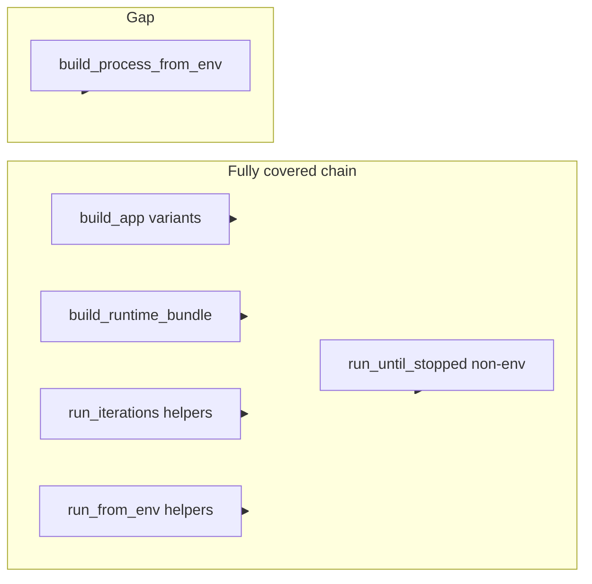

# Minimal httpx-live timeout-policy coverage audit

## 1. Files inspected

- `[backend/src/app/runtime/__init__.py](backend/src/app/runtime/__init__.py)` — публичные re-export’ы httpx live (и policy-константы).
- Httpx live entrypoint modules (только то, что входит в `__all__` для live):  
`[telegram_httpx_live_app.py](backend/src/app/runtime/telegram_httpx_live_app.py)`,  
`[telegram_httpx_live_configured.py](backend/src/app/runtime/telegram_httpx_live_configured.py)`,  
`[telegram_httpx_live_env.py](backend/src/app/runtime/telegram_httpx_live_env.py)`,  
`[telegram_httpx_live_process.py](backend/src/app/runtime/telegram_httpx_live_process.py)`,  
`[telegram_httpx_live_startup.py](backend/src/app/runtime/telegram_httpx_live_startup.py)`,  
`[telegram_httpx_live_runner.py](backend/src/app/runtime/telegram_httpx_live_runner.py)`,  
`[telegram_httpx_live_env_runner.py](backend/src/app/runtime/telegram_httpx_live_env_runner.py)`,  
`[telegram_httpx_live_loop.py](backend/src/app/runtime/telegram_httpx_live_loop.py)`,  
`[telegram_httpx_live_env_loop.py](backend/src/app/runtime/telegram_httpx_live_env_loop.py)`.
- Соответствующие test modules (grep/read по assert’ам сценария):  
`[test_runtime_telegram_httpx_live_app.py](backend/tests/test_runtime_telegram_httpx_live_app.py)`,  
`[test_runtime_telegram_httpx_live_configured.py](backend/tests/test_runtime_telegram_httpx_live_configured.py)`,  
`[test_runtime_telegram_httpx_live_env.py](backend/tests/test_runtime_telegram_httpx_live_env.py)`,  
`[test_runtime_telegram_httpx_live_process.py](backend/tests/test_runtime_telegram_httpx_live_process.py)`,  
`[test_runtime_telegram_httpx_live_startup.py](backend/tests/test_runtime_telegram_httpx_live_startup.py)`,  
`[test_runtime_telegram_httpx_live_runner.py](backend/tests/test_runtime_telegram_httpx_live_runner.py)`,  
`[test_runtime_telegram_httpx_live_env_runner.py](backend/tests/test_runtime_telegram_httpx_live_env_runner.py)`,  
`[test_runtime_telegram_httpx_live_loop.py](backend/tests/test_runtime_telegram_httpx_live_loop.py)`,  
`[test_runtime_telegram_httpx_live_env_loop.py](backend/tests/test_runtime_telegram_httpx_live_env_loop.py)`.

## 2. Assumptions

- **Rollout scope** — публичные символы httpx **live** из `[app.runtime](backend/src/app/runtime/__init__.py)`: фабрики `build_slice1_httpx_live_`*, `run_slice1_httpx_live_`* (без `telegram_httpx_raw_*`, без общих `Slice1PollingRunner` / in-memory bundle’ов).
- **Сценарий** трактуется так: кастомный `PollingPolicy`, ветка `OVERRIDE_HTTPX_TIMEOUT_MODE`, ровно **один** первый `post` на `getUpdates`, `_RecordingFakeAsyncClient` / эквивалент даёт `result: []` (пустой fetch, send-path не активируется), `max_iterations=1` или `run_iterations(1)`, `summary.fetch_failure_count == 0` и `send_failure_count == 0`, `kwargs["timeout"] is expected_timeout`, у записывающей политики — `decisions[0].request_kind == LONG_POLL_FETCH_REQUEST` и `mode == OVERRIDE_HTTPX_TIMEOUT_MODE` (как в «полных» тестах, напр. `[test_runtime_telegram_httpx_live_app.py](backend/tests/test_runtime_telegram_httpx_live_app.py)` — `test_override_httpx_timeout_mode_public_app_path_reaches_get_updates_post`).
- **«Public re-export path»** для проверки: либо прямой вызов через `import app.runtime as rt` там, где тесты уже так делают (runner / env_runner / env_loop), либо эквивалентность `rt.X is submodule.X` + функциональный тест на том же объекте — без требования, чтобы каждый вызов шёл только через префикс `rt.`.

## 3. Security risks

- Юнит-тесты с fake/mock transports **не устраняют** риск продакшена: неверный `httpx.Timeout` на long poll может приводить к зависаниям или преждевременным обрывам; тесты проверяют **протаскивание** таймаута, не безопасность Telegram API.
- Подмена `load_runtime_config` в env-тестах изолирована от реальных секретов; риск утечки токена в этом наборе **низкий**, но токены в фиктивных `RuntimeConfig` всё же не должны попадать в логи вне тестов.

## 4. Coverage map (по сценарию чеклиста)

| Публичный entry / re-export                       | Статус                                                                                                                                                                                                                                                                                                                                                                                       |
| ------------------------------------------------- | -------------------------------------------------------------------------------------------------------------------------------------------------------------------------------------------------------------------------------------------------------------------------------------------------------------------------------------------------------------------------------------------- |
| `build_slice1_httpx_live_runtime_app`             | **Полностью** — `[test_override_httpx_timeout_mode_public_app_path_reaches_get_updates_post](backend/tests/test_runtime_telegram_httpx_live_app.py)` + fake `result: []`.                                                                                                                                                                                                                    |
| `build_slice1_httpx_live_runtime_app_from_config` | **Полностью** — `[test_configured_override_httpx_timeout_reaches_get_updates_post_identity](backend/tests/test_runtime_telegram_httpx_live_configured.py)`.                                                                                                                                                                                                                                  |
| `build_slice1_httpx_live_runtime_app_from_env`    | **Полностью** — `[test_override_httpx_timeout_mode_direct_env_path_reaches_get_updates_post](backend/tests/test_runtime_telegram_httpx_live_env.py)`.                                                                                                                                                                                                                                        |
| `build_slice1_httpx_live_runtime_bundle`          | **Полностью** — `[test_override_httpx_timeout_mode_public_startup_path_reaches_get_updates_post](backend/tests/test_runtime_telegram_httpx_live_startup.py)`.                                                                                                                                                                                                                                |
| `run_slice1_httpx_live_iterations`                | **Полностью** — `[test_override_httpx_timeout_mode_direct_public_runner_path_reaches_getupdates_post](backend/tests/test_runtime_telegram_httpx_live_runner.py)` вызывает `rt.run_slice1_httpx_live_iterations`.                                                                                                                                                                             |
| `run_slice1_httpx_live_iterations_from_env`       | **Полностью** — `[test_public_runtime_entrypoint_override_timeout_env_runner_getupdates_post_identity](backend/tests/test_runtime_telegram_httpx_live_env_runner.py)` через `rt.run_slice1_httpx_live_iterations_from_env` (рядом более слабый тест с `_OverrideAllTimeoutPolicy` без assert’ов на decision — **не считаем регрессом**, т.к. есть полный тест).                              |
| `run_slice1_httpx_live_until_stopped`             | **Полностью по поведению** — `[test_override_httpx_timeout_mode_direct_public_live_loop_path_reaches_getupdates_post](backend/tests/test_runtime_telegram_httpx_live_loop.py)`; вызов через submodule import, плюс identity `rt.run_slice1_httpx_live_until_stopped is ...`. **Частично по симметрии с runner/env:** нет вызова вида `await rt.run_slice1_httpx_live_until_stopped(...)`.    |
| `run_slice1_httpx_live_until_stopped_from_env`    | **Полностью** — `[test_public_runtime_entrypoint_override_timeout_env_loop_getupdates_post_identity](backend/tests/test_runtime_telegram_httpx_live_env_loop.py)`.                                                                                                                                                                                                                           |
| `build_slice1_httpx_live_process_from_env`        | **Частично** — только `[test_override_httpx_timeout_mode_passes_through_public_process_path_to_get_updates_post](backend/tests/test_runtime_telegram_httpx_live_process.py)`: `_FixedOverrideTimeoutPolicy` + `kw["timeout"]` + счётчики; **нет** assert’ов на `PollingTimeoutDecision` с `LONG_POLL_FETCH_REQUEST` / `OVERRIDE_HTTPX_TIMEOUT_MODE` (в файле нет `LONG_POLL_FETCH_REQUEST`). |

## 5. Gaps found

- **Реальный gap по чеклисту:** только `**build_slice1_httpx_live_process_from_env`** — отсутствует тест уровня «recording policy» с проверкой `decisions[0]` на `LONG_POLL_FETCH_REQUEST` и `OVERRIDE_HTTPX_TIMEOUT_MODE` при том же пустом `getUpdates` (остальные публичные live entrypoints такой parity уже имеют).
- **Не gap по функционалу (косметика):** для `run_slice1_httpx_live_until_stoppable` нет сценарного вызова через префикс `rt.` (в отличие от `rt.run_slice1_httpx_live_iterations`); объект тот же — это **не блокер** rollout, если критерий — поведение, а не стиль импорта.
- **Вне scope:** `telegram_httpx_raw_`*, чисто типовые/вспомогательные экспорты без httpx POST, прочие runtime API.

## 6. Recommended next smallest step

- **Один** узкий шаг (рекомендация, без реализации): добавить в `[test_runtime_telegram_httpx_live_process.py](backend/tests/test_runtime_telegram_httpx_live_process.py)` **один** тест по образцу соседних модулей: `_RecordingOverrideTimeoutPolicy` + те же assert’ы на `decisions[0]` и `kwargs["timeout"] is expected_timeout` для `build_slice1_httpx_live_process_from_env` с fake-клиентом и пустым `result` (без изменения существующих тестов и без выделения общих helpers).

## 7. Self-check

- Просмотрены re-export’ы live в `[__init__.py](backend/src/app/runtime/__init__.py)` и все 9 связанных тестовых файлов; сопоставлены assert’ы с заданным чеклистом.
- Подтверждено: `_RecordingFakeAsyncClient.post` в типовых тестах возвращает `{"ok": true, "result": []}` — пустой fetch, один POST.
- Подтверждено grep’ом: в `test_runtime_telegram_httpx_live_process.py` **нет** ссылок на `LONG_POLL_FETCH_REQUEST`, тогда как в остальных live test modules для override-сценария они есть.

**Stop-point:** если цель — **полная parity assert’ов** между всеми публичными httpx live entrypoints, до добавления процесс-теста rollout **не** считать завершённым; если достаточно проверки `timeout` и счётчиков на process-path, можно остановиться, но тогда явно ослабить критерий для одного entrypoint относительно остальных.