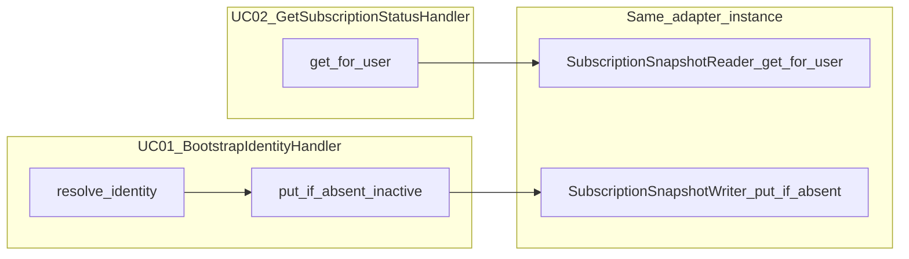

# Минимальный write-path для `subscription_snapshots` (следующий шаг)

## 1. Files to modify

- [backend/src/app/application/interfaces.py](backend/src/app/application/interfaces.py) — добавить отдельный **узкий** Protocol (например `SubscriptionSnapshotRowInitializer` / `SubscriptionSnapshotWriter` с одним методом в духе `put_if_absent(snapshot: SubscriptionSnapshot) -> None`); **не** менять сигнатуру и смысл [`SubscriptionSnapshotReader`](backend/src/app/application/interfaces.py).
- [backend/src/app/application/handlers.py](backend/src/app/application/handlers.py) — расширить [`BootstrapIdentityHandler`](backend/src/app/application/handlers.py): принять writer в `__init__`; на **обоих** успешных путях с известным `internal_user_id` (первая обработка после `create_if_absent` и **idempotent replay** после `find_by_telegram_user_id`) вызвать `put_if_absent` с фиксированным `SubscriptionSnapshot(internal_user_id=..., state_label=SubscriptionSnapshotState.INACTIVE.value)` (или литерал `"inactive"` в одном месте константы рядом с хендлером). **Не** трогать [`GetSubscriptionStatusHandler`](backend/src/app/application/handlers.py).
- [backend/src/app/application/bootstrap.py](backend/src/app/application/bootstrap.py) — при сборке передать **один и тот же** объект snapshots как reader в `GetSubscriptionStatusHandler` и как writer в `BootstrapIdentityHandler`; **не** добавлять новое поле в [`Slice1Composition`](backend/src/app/application/bootstrap.py) (избежать ломания [`test_composition_has_no_extra_service_surface`](backend/tests/test_bootstrap_composition.py)).
- [backend/src/app/persistence/in_memory.py](backend/src/app/persistence/in_memory.py) — реализовать `put_if_absent` на [`InMemorySubscriptionSnapshotReader`](backend/src/app/persistence/in_memory.py): вставка в dict **только если ключа ещё нет** (семантика как `ON CONFLICT DO NOTHING`); оставить [`upsert_for_tests`](backend/src/app/persistence/in_memory.py) для полной перезаписи тестами.
- [backend/src/app/persistence/postgres_subscription_snapshot.py](backend/src/app/persistence/postgres_subscription_snapshot.py) — добавить `put_if_absent` с `INSERT ... ON CONFLICT (internal_user_id) DO NOTHING` и тем же классом ошибок, что и в [`get_for_user`](backend/src/app/persistence/postgres_subscription_snapshot.py) ([`PersistenceDependencyError`](backend/src/app/security/errors.py)); **без** новой миграции при условии текущей схемы PK из [003_subscription_snapshots.sql](backend/migrations/003_subscription_snapshots.sql).
- [backend/src/app/persistence/__init__.py](backend/src/app/persistence/__init__.py) — при необходимости экспорт/реэкспорт (только если проект уже так делает для соседних адаптеров).
- Тесты (узко): [backend/tests/test_bootstrap_composition.py](backend/tests/test_bootstrap_composition.py) — одна проверка «после bootstrap `get_for_user` возвращает `inactive`»; при необходимости точечно [backend/tests/test_application_handlers.py](backend/tests/test_application_handlers.py) если моки UC-01 потребуют writer; опционально расширить/добавить рядом с [backend/tests/test_postgres_subscription_snapshot_reader.py](backend/tests/test_postgres_subscription_snapshot_reader.py) opt-in сценарий «после `put_if_absent` чтение видит строку; повторный вызов не меняет state» (тот же стиль `DATABASE_URL`, что уже есть).

**Не создавать** отдельные ORM-модули, новые миграции, Docker/CI, admin/bot слои.

## 2. Assumptions

- Дефолтная строка для нового пользователя после bootstrap — **`state_label = "inactive"`** ([`SubscriptionSnapshotState.INACTIVE`](backend/src/app/shared/types.py)), согласовано с fail-closed UC-02 ([`map_subscription_status_view`](backend/src/app/domain/status_view.py)): при отсутствии snapshot и при `inactive` пользователю по-прежнему [`INACTIVE_OR_NOT_ELIGIBLE`](backend/src/app/shared/types.py).
- Таблица остаётся как в [003_subscription_snapshots.sql](backend/migrations/003_subscription_snapshots.sql) (PK `internal_user_id`); «безопасная» запись — **только создание отсутствующей строки**, без clobber существующего `state_label` (в т.ч. если позже появятся другие состояния или ручные правки).
- `internal_user_id` для записи всегда берётся из уже разрешённого [`IdentityRecord`](backend/src/app/application/interfaces.py) в UC-01 (никаких новых правил генерации id).
- Явная ветка `build_slice1_composition(identity=..., idempotency=..., snapshots=...)` из [bootstrap.py](backend/src/app/application/bootstrap.py) продолжит передавать один объект, который одновременно удовлетворяет reader (для UC-02) и новому writer-контракту (для UC-01) — как уже делается с одним pool в [slice1_postgres_wiring.py](backend/src/app/persistence/slice1_postgres_wiring.py).

## 3. Security risks

- **Непреднамеренная перезапись статуса**: полноценный `UPSERT` с `DO UPDATE` при каждом bootstrap мог бы опускать уже установленный «истинный» статус до `inactive` — поэтому в шаге сознательно только **`INSERT ... ON CONFLICT DO NOTHING` / in-memory equivalent**.
- **Расширение поверхности в будущем**: если метод writer станет принимать произвольный `state_label` из недоверенного ingress без отдельной политики — риск подделки состояния; на этом шаге вызывать только с **константой** из UC-01.
- **Отказ writer при успешной идентичности**: если `put_if_absent` пробросит `PersistenceDependencyError`, нужно заранее решить политику (рекомендация плана: **fail bootstrap** с тем же классом outcome, что и прочие persistence ошибки UC-01, чтобы не маскировать деградацию БД; альтернатива «проглотить» ухудшает наблюдаемость — не предлагать как дефолт).

## 4. Short changelog

- Введён минимальный контракт записи snapshot-строки «если отсутствует».
- In-memory и Postgres reader-адаптеры научатся безопасно создавать строку по умолчанию.
- UC-01 после успешного разрешения identity гарантирует наличие строки в `subscription_snapshots` для Postgres/in-memory slice-1 без ручного SQL.
- UC-02 и `SubscriptionSnapshotReader` остаются без изменений контракта.

## 5. Proposed minimal design

- **Нужен ли новый application contract?** **Да**, отдельный узкий Protocol (writer / initializer), чтобы **не** раздувать read-only [`SubscriptionSnapshotReader`](backend/src/app/application/interfaces.py) и не смешивать ответственность UC-02.
- **Где ответственность:** **application interface + persistence adapters**; отдельный новый use-case не обязателен — один вызов из существующего UC-01 достаточен для «slice-1 без ручного INSERT».
- **Почему не только persistence:** без вызова из application слоя таблица по-прежнему не заполнится в рантайме.
- **Совместимость с reader и таблицей:** те же колонки [`SubscriptionSnapshot`](backend/src/app/application/interfaces.py); чтение без изменений; SQL только добавляет безопасный insert-if-missing.

## 6. Diff summary

- Небольшие правки в **5–6 файлах** (interfaces, handlers, bootstrap, in_memory, postgres_subscription_snapshot, 1–2 тестовых файла).
- **Без** правок [handlers.py](backend/src/app/application/handlers.py) UC-02, [003_subscription_snapshots.sql](backend/migrations/003_subscription_snapshots.sql), [slice1_postgres_wiring.py](backend/src/app/persistence/slice1_postgres_wiring.py) кроме случая переименования класса (не планируется), крупного [bootstrap.py](backend/src/app/application/bootstrap.py) рефакторинга.

## 7. Self-check

- **Acceptance criteria следующего шага:** после успешного UC-01 для нового пользователя в Postgres (с миграцией 003) `SELECT` по `internal_user_id` возвращает `inactive` без ручного INSERT; повторный UC-01 (replay) **не** меняет `state_label` если строка уже существует с другим значением (тест с ручной предустановкой строки в opt-in Postgres тесте); in-memory e2e: после bootstrap `c.snapshots.get_for_user` не `None`; UC-02 outcomes для дефолтного пользователя остаются как сейчас ([`INACTIVE_OR_NOT_ELIGIBLE`](backend/src/app/shared/types.py)); линтер/тесты зелёные.
- **Файлы лучше не трогать на этом шаге:** transport ([dispatcher](backend/src/app/bot_transport/dispatcher.py), [service](backend/src/app/bot_transport/service.py)), admin/ADM, billing/webhooks, миграции Alembic/ORM, Docker/CI, [`GetSubscriptionStatusHandler`](backend/src/app/application/handlers.py), [`slice1_postgres_wiring.py`](backend/src/app/persistence/slice1_postgres_wiring.py) (pool wiring уже передаёт один reader — достаточно расширить класс reader).
