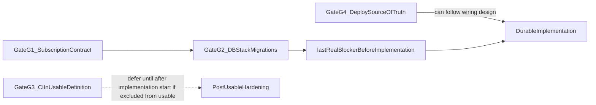

# Decision-gated roadmap: схлопывание неопределённости usable MVP

Ниже — один аналитический шаг: из [mvp_delivery_scenarios_5237e7b8.plan.md](.cursor/plans/mvp_delivery_scenarios_5237e7b8.plan.md) и согласованных первичников вынесены **решения-ворота**, которые двигают строку «Decision on subscription», «Durable slice-1 repos + migrations», «Single composition root», «Minimal deploy», «Stabilization» без пересборки всего scope.

---

## 1. Files inspected

- [.cursor/plans/mvp_delivery_scenarios_5237e7b8.plan.md](.cursor/plans/mvp_delivery_scenarios_5237e7b8.plan.md)
- [.cursor/plans/mvp_readiness_snapshot_9aa9dc45.plan.md](.cursor/plans/mvp_readiness_snapshot_9aa9dc45.plan.md)
- [.cursor/plans/persistence_scope_usable_mvp_34ab3368.plan.md](.cursor/plans/persistence_scope_usable_mvp_34ab3368.plan.md)
- [.cursor/plans/mvp_delivery_horizons_7c3aaef5.plan.md](.cursor/plans/mvp_delivery_horizons_7c3aaef5.plan.md)

Код не открывался: все ворота проверяются ссылками на уже зафиксированные факты в этих планах (live-path без `database_url`, отсутствие Dockerfile, grep по адаптерам, семантика UC-02 без строки snapshot).

---

## 2. Assumptions

- **Usable MVP** трактуется так же, как в перечисленных планах: slice-1 по [docs/architecture/15-first-implementation-slice.md](docs/architecture/15-first-implementation-slice.md), **PostgreSQL SoT** для identity + idempotency + audit + явное решение по subscription read model, **одна composition-точка** от `RuntimeConfig` до тех же репозиториев, что у live handlers, **минимальный** deploy/run story (артефакт в репо или явный внешний runbook, но согласованный с `BOT_TOKEN` / `DATABASE_URL`).
- **Цель этого шага** — не новая оценка в ew, а **сужение диапазона** за счёт закрытия развилок; ew-полоса из scenarios остаётся опорной, пока не зафиксированы ворота 1–2 и (при необходимости) короткий spike по вороту 2.
- **Production-like** намеренно вне глубины: только там, где определение usable влияет на «входит ли CI с Postgres в usable».
- Один сильный инженер, последовательный критический путь; календарь не выводится из документов (как в scenarios/horizons).

---

## 3. Security risks

(Релевантно тому, что ворота должны закрыть «честно», а не «быстро на бумаге».)

- **In-memory SoT до durable:** рестарт → потеря identity/idempotency/audit → срыв дедupe и расследуемости ([snapshot](.cursor/plans/mvp_readiness_snapshot_9aa9dc45.plan.md), [persistence scope](.cursor/plans/persistence_scope_usable_mvp_34ab3368.plan.md)).
- **`DATABASE_URL` обязателен, live-path БД не использует:** ложная зрелость и риск деплоя с секретами БД без реальной модели данных в приложении ([horizons](.cursor/plans/mvp_delivery_horizons_7c3aaef5.plan.md), [persistence scope](.cursor/plans/persistence_scope_usable_mvp_34ab3368.plan.md)).
- **Audit сейчас по факту success-path:** при переходе на БД — слабее доказуемость неуспехов относительно [15](docs/architecture/15-first-implementation-slice.md) ([persistence scope](.cursor/plans/persistence_scope_usable_mvp_34ab3368.plan.md)); это может остаться post-usable, если политика мягкая, иначе раздувает стабилизацию.
- **PII (`telegram_user_id` и др.) в БД:** доступ, бэкапы, минимизация — стандартный класс при появлении durable store ([persistence scope](.cursor/plans/persistence_scope_usable_mvp_34ab3368.plan.md)).
- **Секреты через env:** утечка через логи/окружение; снижается дисциплиной, не исчезает ([horizons](.cursor/plans/mvp_delivery_horizons_7c3aaef5.plan.md)).

---

## 4. Decision gates that drive usable MVP timeline

Ниже **четыре** ворота (достаточно, чтобы покрыть основной разброс строк scenarios: subscription + DDL, very large persistence, wiring, deploy, опционально CI). Пятое сознательно **не раздувается**: транзакционная семантика UC-01 в основном **не снимается одной встречей** без кода/нагрузочных проверок — она входит в реализацию после ворот 1–2, а не как отдельный «фантазийный» gate.

### Gate G1 — Subscription read model (A vs B)

- **Что решить:** Зафиксировать контракт durable read model для UC-02: **(A)** нет строки snapshot ⇒ inactive / not eligible (согласовано с текущим read-path в [persistence scope](.cursor/plans/persistence_scope_usable_mvp_34ab3368.plan.md)) vs **(B)** таблица snapshot + default bootstrap.
- **Допустимые варианты:** A; B (с миграциями и политикой bootstrap).
- **Минимизирует time-to-usable:** **A** — меньше DDL, нет отдельного bootstrap-слоя для snapshot ([scenarios](.cursor/plans/mvp_delivery_scenarios_5237e7b8.plan.md): строка «Decision on subscription» + блок durable repos).
- **Если тяжелее (B):** растёт DDL, миграции, `SubscriptionSnapshotReader` backing, политика default — верхняя ветка conservative по scenarios.
- **Аналитика vs spike:** **Аналитически сейчас** — достаточно явного решения продукта/архитектуры против open question в [15](docs/architecture/15-first-implementation-slice.md) / [06](docs/architecture/06-database-schema.md), как уже сформулировано в [persistence scope](.cursor/plans/persistence_scope_usable_mvp_34ab3368.plan.md).

### Gate G2 — PostgreSQL access + migrations toolchain

- **Что решить:** Единый выбор: драйвер/пул, sync vs async относительно live runtime, инструмент миграций, стиль SQL (raw vs ORM) — то, что в [scenarios](.cursor/plans/mvp_delivery_scenarios_5237e7b8.plan.md) названо «стек доступа к БД и стиль миграций» и в [horizons](.cursor/plans/mvp_delivery_horizons_7c3aaef5.plan.md) — главный uncertainty driver для **very large** persistence.
- **Допустимые варианты:** (i) минимальный «скучный» стек под текущий кодовый стиль команды; (ii) более «идеологически чистый» async-native слой; (iii) смена подхода mid-flight (явно запрещён как вариант, но это реальный риск раздувания — [scenarios](.cursor/plans/mvp_delivery_scenarios_5237e7b8.plan.md) «переделки миграций»).
- **Минимизирует time-to-usable:** **Один** зафиксированный стек + **один** путь миграций, без параллельной оценки ORM; при неизвестности — **короткий spike** (см. секцию 7), а не бесконечная аналитика.
- **Если тяжелее:** переделки схемы/адаптеров, рост строки «Durable slice-1 repos + migrations» и «Stabilization» в scenarios.
- **Аналитика vs spike:** **Аналитика + bounded spike** (одна вертикаль «pool → один репозиторий → миграция»); чистой аналитики недостаточно, пока не проверен реальный friction с выбранным стеком ([scenarios](.cursor/plans/mvp_delivery_scenarios_5237e7b8.plan.md)).

### Gate G3 — «Usable» включает CI с реальной PostgreSQL или нет

- **Что решить:** Входит ли в **определение done** для usable MVP зелёный main (или эквивалент) **с миграциями против живой Postgres** ([scenarios](.cursor/plans/mvp_delivery_scenarios_5237e7b8.plan.md) driver 4).
- **Допустимые варианты:** Usable **без** обязательной CI-БД (ручной/периодический контур + честный deploy); Usable **с** CI-БД как часть критерия готовности.
- **Минимизирует time-to-usable:** **Не включать CI-БД в usable-definition** (перенос в post-usable / первый hardening increment), если цель — именно сузить календарь до первого переживаемого рестарта SoT в прод-пилоте.
- **Если тяжелее:** добавляется ось «инфра + флейки + время пайплайна» — это **не** ядро persistence, но двигает хвост стабилизации и календарь релизов.
- **Аналитика vs spike:** **Аналитически сейчас** (политика команды/риска), реализация — отдельно от первого DB slice.

### Gate G4 — Minimal deploy: источник истины

- **Что решить:** Минимальный deploy — **артефакт в репо** (Dockerfile/compose) vs **внешний runbook** как единственная «истина», при том что в [horizons](.cursor/plans/mvp_delivery_horizons_7c3aaef5.plan.md) зафиксировано отсутствие Dockerfile в корне.
- **Допустимые варианты:** In-repo минимальный compose; только внешний runbook с явным gap в репо.
- **Минимизирует time-to-usable для честного usable:** **In-repo минимальный артефакт** — снимает класс риска «док не воспроизводится из репо» и согласуется с «минимальный deploy» в [snapshot](.cursor/plans/mvp_readiness_snapshot_9aa9dc45.plan.md).
- **Если тяжелее (только runbook):** быстрее на бумаге, но **оставляет организационный и security-долг** (who runs what, drift) и не снимает замечание audit/horizons про пустой репо.
- **Аналитика vs spike:** **Аналитически сейчас** (где живёт истина), реализация — небольшой инкремент после ворот G1–G2, но **решение** должно быть до обещаний стейкхолдерам.

### (Уже частично «закрыто» документами — не раздувать)

- **Scope usable vs post-usable:** [persistence scope](.cursor/plans/persistence_scope_usable_mvp_34ab3368.plan.md) уже отрезает billing/ADM и т.д. Это **не ворот** для дальнейшего обсуждения, пока не меняется [15](docs/architecture/15-first-implementation-slice.md).

---

## 5. Cheapest acceptable choices for each gate

| Gate | Cheapest acceptable choice (с учётом честности usable) |
|------|----------------------------------------------------------|
| G1 | **A** — implicit absent snapshot = inactive/not eligible, явно записанный контракт в 1 абзаце + ссылка на [15](docs/architecture/15-first-implementation-slice.md). |
| G2 | **Один зафиксированный стек** + **один** migration path; если нет доменного опыта — **короткий spike** перед массовыми миграциями (не параллельные альтернативы). |
| G3 | **Usable done без обязательной CI-Postgres**, если цель — сначала переживаемый рестарт и честный runtime; CI-БД — следующий инкремент. |
| G4 | **In-repo Dockerfile/compose** как минимальная воспроизводимость, даже если прод позже на «чужом» хостинге. |

---

## 6. Recommended order to close the gates

- **Первым закрыть G1:** иначе DDL и миграции для slice-1 остаются двусмысленными ([persistence scope](.cursor/plans/persistence_scope_usable_mvp_34ab3368.plan.md) явно связывает таблицу subscription с вариантом B).
- **Вторым G2:** без него нельзя честно начинать массовую реализацию адаптеров без риска переделки ([scenarios](.cursor/plans/mvp_delivery_scenarios_5237e7b8.plan.md) uncertainty #2 и «ломающийся вверх» фактор переделок).
- **Отложить до после старта реализации (если выбрано в G3):** **G3** — политика CI не блокирует первый вертикальный «pool + identity + idempotency в одной транзакции», если usable-definition сознательно узкая.
- **G4:** решение — **раньше обещаний внешним людям**; артефакт может появиться **после** первого рабочего wiring, но **не после** «мы уже в проде без воспроизводимого контура».
- **Последний настоящий blocker перед durable implementation:** не «ещё один аудит», а **G2 закрыт выбором + (при необходимости) результатом bounded spike**: до этого момента полоса по «Durable slice-1 repos» остаётся **very large** с высокой дисперсией ([horizons](.cursor/plans/mvp_delivery_horizons_7c3aaef5.plan.md)).

Критический путь по работам (как в [snapshot](.cursor/plans/mvp_readiness_snapshot_9aa9dc45.plan.md) / [horizons](.cursor/plans/mvp_delivery_horizons_7c3aaef5.plan.md)) после ворот: **durable slice-1 persistence → единый wiring config→DB→handlers→live → minimal deploy** — без изменения; ворота лишь **фиксируют параметры**, из-за которых строки scenarios разъезжаются.

---

## 7. Single next analytical step

**Один следующий шаг:** провести **bounded spike (не больше 1–2 инженер-дней)** на выбранном после G1 кандидате стека (G2): *одна миграция + пул/сессия + DB-backed `UserIdentityRepository` **или** `IdempotencyRepository` в минимальной транзакции*, с явным go/no-go критерием «мы оставляем этот стек для остальных адаптеров». Это максимально схлопывает **conservative** ветку блока «Durable slice-1 repos + migrations» в [scenarios](.cursor/plans/mvp_delivery_scenarios_5237e7b8.plan.md), которую одной встречей не снять.

**Почему точность всё ещё может оставаться средней:** даже после G1–G4 остаётся **реализационный** риск UC-01 под конкуренцией и recovery ([scenarios](.cursor/plans/mvp_delivery_scenarios_5237e7b8.plan.md) uncertainty #3) — он **не исчезает документами**, только сужается выбором стека и явными инвариантами из [persistence scope](.cursor/plans/persistence_scope_usable_mvp_34ab3368.plan.md).
