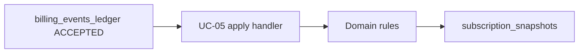

## 30 — UC-05: apply accepted billing fact to subscription (bounded design)

### Status

**Proposed** — design-only. No application code, SQL, migrations, or workflow changes in this document.

### Context

- **Billing facts** are already persisted append-only in `billing_events_ledger` with normalized fields (no raw provider payload in this path).
- **Billing ingestion audit** exists; on the PostgreSQL operator path, ledger append and `billing_ingestion_audit_events` are written in one atomic transaction (coherent evidence pair). Retention policy for the audit table is in `backend/docs/adr_billing_ingestion_audit_retention.md` (out of scope here).
- **UC-04** ingestion in `backend/src/app/application/billing_ingestion.py` explicitly leaves **UC-05 apply-to-subscription out of scope** for the ingestion module.
- **UC-05** — applying an **accepted** ledger fact to **subscription lifecycle / `subscription_snapshots`** — is the product gap: ledger receives facts; subscription read model is not yet driven by them.
- **UC-06 (config issuance)** and entitlement depend on subscription/entitlement state; issuance and delivery of access config are **out of scope** for this design. This document only covers the bridge from accepted billing evidence to **safe** internal subscription state.

### Scope

- **Internal application use case** (no public webhook, no new ingress): load a billing fact from persistence, validate it for apply, map through domain rules, then **write or update** the user’s subscription state/snapshot **only** when rules allow.
- **Load key (preferred)**: `internal_fact_ref` — stable correlation with ledger rows and billing ingestion audit (see `BillingEventLedgerRecord` in `backend/src/app/persistence/billing_events_ledger_contracts.py`).
- **Load key (alternative)**: pair `(billing_provider_key, external_event_id)` — idempotent with ledger uniqueness; must resolve to the same canonical row as `internal_fact_ref` when both are present.
- **User binding**: apply must **only** transition subscription state for a user when there is a **safe, validated** mapping to `internal_user_id` (from the fact and/or resolvable checkout linkage). If mapping cannot be established, **do not** treat the user as paid/active; use fail-closed / `needs_review` (see [09 — Subscription lifecycle](09-subscription-lifecycle.md)).
- **After validation** — persist subscription snapshot (or quarantine / needs-review state) in line with this document. No “silent” activation.

### Non-goals

- Public billing webhook, provider-specific parsing, or signature verification (covered at ingestion/boundary, not in UC-05).
- Telegram checkout (UC-03) or transport changes.
- Config issuance, access config delivery, or UC-06 orchestration.
- Implementation of **billing retention**, cleanup jobs, or changes to the billing ingestion audit ADR.
- Any change to **runtime** behavior in this step (this file is design-only until implemented elsewhere).

### Input boundary

- **Preferred**: `internal_fact_ref` — aligns with internal correlation, audit records, and operator triage; avoids ambiguous secondary lookups when the ref is known.
- **Alternate**: `billing_provider_key` + `external_event_id` — must resolve to a single ledger row; duplicates/ignored status handling follows repository semantics (`append_or_get` idempotency).
- **`internal_user_id`**: Required for a **successful, entitlement-bearing apply** in the common case. If the stored fact has `internal_user_id = null` (or cannot be derived safely from `checkout_attempt_id` and other internal linkage), treat as **not applicable for automatic activation** → quarantine path / `needs_review` / fail-closed (see [09](09-subscription-lifecycle.md), ST-06 `needs_review`).
- **`checkout_attempt_id`**: When present, supports correlating the fact to a prior **checkout / payment intent** stored by the application. Use to disambiguate user/scope and to validate that the fact matches an expected purchase attempt. If matching is **required** by product rules but checkout cannot be found or conflicts, fail-closed.
- All inputs at this boundary are **application-defined**; strict validation, length bounds, and idempotency keys are enforcement concerns for the implementation step (not specified here as code).

### Domain rules

- **Only** rows with `BillingEventLedgerStatus.ACCEPTED` are eligible to drive subscription state transitions. Facts recorded as `DUPLICATE` or `IGNORED` **do not** activate or extend a subscription; any apply handler must no-op or resolve to a safe “already handled / not applicable” outcome (fail-closed for “paid” semantics).
- **Idempotent re-apply**: processing the same logical fact twice (retry, at-least-once delivery) must not double-apply period extensions or repeat irreversible side-effects. “Apply once” semantics are required.
- **Out-of-order** external facts: follow subscription lifecycle invariants in [09-subscription-lifecycle.md](09-subscription-lifecycle.md) — either apply safely with monotonic/ordering rules, or transition to `needs_review` if a consistent lifecycle outcome cannot be determined.
- **Amount / currency** (`amount_minor_units`, `currency_code` in ledger) vs expected plan/price: **open question** until product signs off; if mismatch is detected, default posture is **fail-closed** / `needs_review` rather than granting access. No numeric **final** price, duration, or TTL is asserted in this document.

### State mapping

- **`subscription_snapshots`**: current schema is effectively `(internal_user_id, state_label)` in the PostgreSQL reader (`backend/src/app/persistence/postgres_subscription_snapshot.py`). Values must remain compatible with the read path used for UC-02.
- **Current writer contract**: `SubscriptionSnapshotWriter` only supports **`put_if_absent`** (`backend/src/app/application/interfaces.py`); there is **no** general update/upsert for changing `state_label` after insert. **UC-05 implementation will require** either an extended writer protocol (e.g. conditional update by user), a dedicated “apply” repository, and/or a **future migration** if additional columns (e.g. period end, last applied `internal_fact_ref`) are needed. This design **does not** specify DDL.
- **Relation to [09](09-subscription-lifecycle.md)**: `state_label` (or a future column set) should be able to represent at least: inactive/pending payment/active/expired/canceled/needs review, in line with the conceptual states there. **Exact** string `Enum` in `backend/src/app/shared/types.py` may need extension when billing-backed `active` is first modeled.
- **`needs_review`**: When automatic apply is unsafe, subscription-facing state should reflect `needs_review` (or equivalent) so entitlement and `/status` remain fail-closed. See [09](09-subscription-lifecycle.md) ST-06 and entitlement linkage.
- **`/status` (UC-02)**: `map_subscription_status_view` in `backend/src/app/domain/status_view.py` currently does **not** treat billing-backed states as “paid active” until explicitly allowlisted (`_BILLING_BACKED_ACTIVE` is empty). Any new “active from billing” mapping must be **opt-in and safety-reviewed** so users never see paid access without a modeled, audited state transition.

### Idempotency

- **Key options**: (a) `internal_fact_ref` as the idempotency key for “this apply completed”; and/or (b) composite `(internal_user_id, internal_fact_ref)`; and/or (c) `(billing_provider_key, external_event_id)` if ref-less paths exist. The implementation should choose a single primary key visible in storage for replay = no-op.
- **Apply-once semantics**: first successful apply records outcome; subsequent invocations return idempotent no-op and **must not** re-audit as a new state transition.
- **Replay** of the same fact: **no new** lifecycle effect.
- **Apply audit**: state-changing apply should produce an **append-only** audit record (or extend an existing audit surface) with correlation to `internal_fact_ref` / `ingestion_correlation_id`, **without** raw payload. Whether a new table is introduced vs reuse of an existing app audit mechanism is an **open question** for the implementation pass.

### Quarantine / fail-closed

- **Unknown user** (`internal_user_id` null and not resolvable): no automatic subscription activation; prefer `needs_review` / operational triage per [08-billing-abstraction.md](08-billing-abstraction.md) and [09](09-subscription-lifecycle.md).
- **No checkout** when the product requires checkout correlation: fail-closed; do not guess user from external IDs alone.
- **Unknown or unsupported `event_type`**: do not map to `active` without an explicit allowlist in domain rules; default to no-op or `needs_review` depending on severity.
- **Conflicting facts** (e.g. incompatible with already applied state): fail-closed; `needs_review` rather than partial overwrite of subscription truth.

### Security / privacy

- **No** raw provider payload in apply path, logs, or audit; normalized fields only (aligned with ledger and ingestion policy).
- **No** secrets, webhook signing material, or DSNs in logs or design examples.
- **Minimize PII**: log and audit internal references (`internal_user_id`, `internal_fact_ref`, allowlisted reason codes) rather than free-form or external PII.
- **Auditability**: every successful subscription state change from billing should be traceable to a ledger fact and correlation id.
- **Transaction boundaries**: apply (read fact → domain decision → write snapshot → write apply idempotency / audit) should be **one unit of work** where the implementation supports it, so partial updates cannot leave “paid” without a recorded apply outcome. Exact isolation level and retry strategy are implementation details; **fail-closed** on persistence errors (no activation on ambiguous commit).

### Acceptance criteria (for a follow-up implementation / AGENT)

- **Unit tests** with in-memory ledger and snapshot / idempotency fakes; cover duplicate apply, non-`ACCEPTED` facts, missing user, and out-of-order scenarios at the application/domain boundary.
- **Optional** PostgreSQL tests when schema and contract exist (e.g. snapshot update path).
- **Invalid or non-qualifying facts** cannot set entitlement to “active” in tests (even if full entitlement module is not wired).
- **`/status`** only reflects an applied “billing-backed” active (or similar) when `status_view` (or its successor) explicitly maps that state; until then, remains fail-closed.
- **Idempotent apply** verified by test (second call = no state delta / idempotent outcome).

### Open questions

- **Supported `event_type` allowlist** and mapping to lifecycle transitions (payment success, renewal, cancel, refund, etc.).
- **Duration / renewal** semantics: fixed period, anchor time, or provider-driven end date — **product decision**; not fixed in this document.
- **Does successful payment immediately activate** subscription, or is there an intermediate `pending_payment` until apply completes? (Orchestration ordering.)
- **Refund / chargeback / reversal**: automatic downgrade vs mandatory `needs_review` — [09](09-subscription-lifecycle.md) leans to high risk and review; exact rules TBD.
- **Schema and writer contract**: whether to add columns to `subscription_snapshots` (e.g. `period_ends_at`, `last_applied_internal_fact_ref`) vs minimal `state_label` only for v1.
- **Apply audit** surface: new append-only table vs existing audit appender; correlation with `billing_ingestion_audit_events` (same fact, different step).

### Reference diagram (apply placement)

### References (read-only anchors)

- [03 — Domain and use-cases](03-domain-and-use-cases.md) — UC-05 definition.
- [08 — Billing abstraction](08-billing-abstraction.md) — ledger vs subscription, post-accept apply.
- [09 — Subscription lifecycle](09-subscription-lifecycle.md) — states, out-of-order, `needs_review`.
- [10 — Config issuance](10-config-issuance-abstraction.md) — issuance out of scope; depends on entitlement after subscription truth.
- [13 — Security controls](13-security-controls-baseline.md) — validation, audit, fail-closed.
- `backend/docs/adr_billing_ingestion_audit_retention.md` — ingestion audit retention, not apply.
