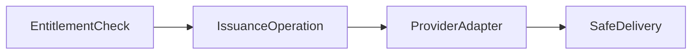

## 33 — Config issuance v1 — MVP design slice

### Status

**Proposed** — design-only. No application code, SQL, migrations, or workflow changes in this document.

---

### A. Context

- **UC-05** (apply accepted billing fact to subscription) can produce a subscription snapshot that the domain treats as **active** after the apply path and domain rules complete — see [30-uc-05-apply-billing-fact-to-subscription.md](30-uc-05-apply-billing-fact-to-subscription.md) and [09-subscription-lifecycle.md](09-subscription-lifecycle.md).
- **Config issuance** (access instructions, safe references) must depend on **entitlement / subscription state in SoT** after apply rules, **not** on “raw” billing provider truth or on transport messages. Billing facts enter through ingest + apply; issuance gates on the **resulting** internal state.
- [10-config-issuance-abstraction.md](10-config-issuance-abstraction.md) defines the broader **provider-neutral issuance abstraction** (capabilities, boundary rules, conceptual states). **This document narrows v1 (MVP)** to a bounded, safe slice: preconditions, gate, operational semantics, and explicit non-goals before implementation.
- **Public billing webhook** ingress (design space in [31-public-billing-ingress-security.md](31-public-billing-ingress-security.md) / [32-public-billing-ingress-decisions-adr.md](32-public-billing-ingress-decisions-adr.md)) remains a **parallel track** with TBDs; it is **not** a prerequisite for fixing **this** issuance design, as long as accepted facts and UC-05 can establish internal subscription state (e.g. operator path).

**Code alignment (read-only anchors, no spec of implementation here):** [status_view.py](../../backend/src/app/domain/status_view.py) maps subscription snapshot to safe user-facing status; [types.py](../../backend/src/app/shared/types.py) defines `SubscriptionSnapshotState` and `SafeUserStatusCategory`; [handlers.py](../../backend/src/app/application/handlers.py) orchestrates UC-02. Issuance in v1 must **not** contradict the same entitlement interpretation that drives `/status` for a given user/snapshot (see [C](#c-preconditions--entitlement-gate)).

---

### B. Scope (UC-06 / UC-07 / UC-08 v1)

**v1 interprets the use-cases** (see [03-domain-and-use-cases.md](03-domain-and-use-cases.md) and [10](10-config-issuance-abstraction.md)) as design intent only:

| Use-case (conceptual) | v1 meaning |
|----------------------|------------|
| **UC-06 — Issue** | After entitlement gate, obtain **safe access instructions** and/or a **redacted or opaque config reference** (per product policy) via a **conceptual** provider operation; **no** selection of a concrete access/config vendor or product in this document. |
| **UC-08 — Resend** | Redeliver **already-known safe delivery content** (or a safe redacted view) for the current valid issuance **without** a new side-effect that creates a **new** provider access artifact, unless product explicitly opts into reissue/rotate later (separate intent). |
| **UC-07 — Revoke** | When entitlement no longer allows access (e.g. subscription not active) **or** when a **manual/admin revoke** is authorized, drive **revoke** at the conceptual provider boundary and mark operational issuance as revoked when confirmed. |

- **v1** is a **provider-agnostic internal contract / design** (orchestration expectations, gate, fail-closed rules, failure taxonomy, audit/observability). It is **not** a provider SDK, API schema, or vendor choice.
- **Provider / vendor selection** remains **explicitly out of scope**; adapters are assumed only as **pluggable** boundaries, names-only where useful.

---

### C. Preconditions / entitlement gate

- **Issuance may run only** when, per **domain/SoT state**, the user’s subscription is **explicitly treated as `active` (or equivalent)** in the read model that feeds entitlement, **and** no fail-closed overlay applies (see [09](09-subscription-lifecycle.md): e.g. `needs_review`, policy block, missing user mapping should deny automatic access).
- **Fail-closed — no issuance, no “safe to deliver” upgrade**, when:
  - subscription lifecycle is **`needs_review`**, or
  - user is not eligible (`inactive`, `expired`, `canceled` per product rules, `pending_payment`, etc.), or
  - **missing snapshot** / **unknown** subscription classification where the domain cannot assert active entitlement, or
  - any **unknown or indeterminate** state that would cause `/status` to be non-active or needs-review in the [status_view](../../backend/src/app/domain/status_view.py) / future aligned mapping.
- **Single interpretation rule:** the **entitlement test** used to allow **issue** or **resend** must be **the same** as the logic that justifies what `/status` shows for **subscription** (no separate “lax” path for issuance). If implementation temporarily diverges in code, it is a **defect** relative to this design.

---

### D. Issuance state model (design categories)

These are **design / conversation labels**, not mandated DB columns (implementation may model them differently; see [10](10-config-issuance-abstraction.md) candidate states S-I01–S-I05 for the umbrella).

| Category | Meaning (v1) |
|----------|----------------|
| `not_issued` | No confirmed successful issue for the current context / epoch. |
| `issued` | Provider (conceptually) has confirmed a successful create/ensure; the system is allowed to consider safe delivery **only** as described in this doc, not to infer billing truth. |
| `revoked` | Access has been invalidated at the provider (or “revoked as policy”) per confirmed outcome. |
| `needs_review` | **Cross-cutting:** subscription or quarantine state requires **manual triage**; **automatic** issuance and automatic resend of access material are **not** allowed until resolved. |

- **Idempotency expectation (default for v1):** repeated **issue** for the same user/subscription entitlement window should not create an unbounded chain of new provider side-effects: **idempotent** “same intent → same class of outcome” and **resend** must not create duplicate provider resources **unless** product explicitly requests **reissue/rotate** as a different operation. **Revoke** must be idempotent (safe repeats).

---

### E. Secret / config material boundaries

- **Do not log** private keys, tokens, raw config bodies, access URLs with embedded secrets, PEM material, or provider **credentials**; align with [12-observability-boundary.md](12-observability-boundary.md) and [13-security-controls-baseline.md](13-security-controls-baseline.md) (e.g. Class B “issued access secrets”).
- **Prefer** storing **references/handles** and operational status in future persistence, **not** the full sensitive config as the default. Any encrypted-at-rest design for held material is a **separate, explicit** decision; not asserted here.
- **Operator/admin** views must use **redaction** (summaries, categories) — see [I](#i-relationship-to-adminsupport).

**This document does not** include real VPN config examples, credential examples, or secret material.

---

### F. Idempotency and audit

- **Issue:** idempotent for the same logical user/subscription entitlement context (see [D](#d-issuance-state-model-design-categories)); conflicts or ambiguous keys → fail-closed (per [10](10-config-issuance-abstraction.md)).
- **Resend:** must not create a **new** provider-side access artifact by default; audit distinguishes **resend** from **reissue/rotate** if the product adds the latter later.
- **Revoke:** idempotent; `already_revoked` is a valid class of outcome; **unknown** revoke remains fail-closed for “trust that access is gone” (repair/reconcile as in [10](10-config-issuance-abstraction.md)).
- **Audit:** append-only (or append-only semantic) events for **attempts** and **outcome categories** for issue / resend / revoke; **no** secret content; correlation ids; actor class (user/system/admin) where applicable. Align with [12](12-observability-boundary.md) (categories, not payload).

---

### G. Provider boundary (conceptual only)

Conceptual operations (names illustrative, **not** a chosen vendor API):

1. **`create_or_ensure_access`** — establish access at the provider; returns normalized **success/unknown/failure** and a **reference** where applicable, not subscription truth.
2. **`revoke_access`** — invalidate that access; idempotent semantics.
3. **`get_safe_delivery_instructions_or_reference`** — content safe for the chosen delivery channel, or a **redacted** / opaque **reference** suitable for support/product policy.

- **Provider errors** → **fail-closed:** do **not** transition to a user-trusted `issued` state **unless** provider **success** is unambiguously confirmed. **Unknown** outcomes do **not** enable delivery of access material.
- **No** concrete provider, product, or HTTP/JSON schema in v1 (see [K](#k-non-goals)).

**Short Mermaid (no API detail):**

---

### H. User-facing delivery boundary (Telegram / other transport)

- **Telegram** (or any transport) may send **only** **safe** content after the issuance path has a **safe** result (entitlement + confirmed provider outcome + policy) — see [07-telegram-bot-application-boundary.md](07-telegram-bot-application-boundary.md).
- **No** full secret config in **logs**, **stdout**, or **metrics**.

**If product has not yet chosen a delivery model**, treat the following as **open questions** (not decisions in this doc): short **instruction** message; **support handoff**; **redacted reference**; **other** safe model; and whether a “sensitive delivery material” class (distinct from non-secret instruction) is needed per [10](10-config-issuance-abstraction.md).

**Proposed envelope:** user-facing safe response classes and mapping intent (Telegram resend context) — [35-user-facing-safe-access-delivery-envelope.md](35-user-facing-safe-access-delivery-envelope.md).

---

### I. Relationship to admin / support

- The codebase already exposes a **read port** for issuance summary: [Adm01IssuanceReadPort](../../backend/src/app/admin_support/contracts.py) returning [IssuanceOperationalSummary](../../backend/src/app/admin_support/contracts.py) (operational `state` enum without secrets). v1 design expects any future real implementation to feed this with **redacted, low-cardinality** data only.
- **Admin/support** may read **issuance/summary** for triage, **not** full secret material.
- **Manual** support actions (resend, forced revoke, etc.) require **RBAC/allowlist**, **reason codes** where state-changing, and **audit** — per [11-admin-support-and-audit-boundary.md](11-admin-support-and-audit-boundary.md) and [13](13-security-controls-baseline.md). No automation of “override billing truth” via issuance.

---

### J. Failure taxonomy (v1) and observability

Normalized **categories** (for logs/metrics/audit/structured handling); **not** an implementation enum. Map to observability without embedding secrets — see [12-observability-boundary.md](12-observability-boundary.md) (e.g. SG-04 Issuance, `UnknownOutcome`).

| Category | When |
|----------|------|
| `not_entitled` | Gate failed: subscription/entitlement does not allow issuance. |
| `needs_review` | Quarantine or lifecycle/system state blocks automatic issuance. |
| `provider_unavailable` | Transient/dependency failure (may be retryable at app policy). |
| `provider_rejected` | Definitive rejection from provider side. |
| `already_issued` | Idempotent replay / safe “already have issuance” (no new secret by default). |
| `revoked` | Outcome of revoke or user not entitled because access was revoked. |
| `unsafe_to_deliver` | Invariant would breach safe delivery (e.g. no safe instruction available). |
| `internal_error` | Bug or unexpected internal failure after classification. |

**Logs and metrics** should use these **category labels** (and low-cardinality dependency keys), not raw config or error bodies with secrets.

---

### K. Non-goals (v1 design slice)

- Choosing or certifying a **concrete** access / config **provider** or on-prem product.
- Implementing **provider SDKs**, client libraries, or **API schemas**.
- Storing **raw** user configs, private keys, or unredacted access artifacts as the default SoT in DB.
- **Public billing webhook**, **payment** processing, or **public HTTP** product surface in this step.
- **SQL**, **migrations**, or persistence schema.
- **Telegram** message copy, command wiring, or transport implementation of issuance.
- **Unattended automation** of the full “issue+deliver+rotate” product loop beyond what product defines later.
- **Final** SLA, **TTL**, or **duration** of access or instruction validity **without** product sign-off.
- **Final** RBAC matrix for all admin tools (policy stated as a requirement, details TBD in product/security).

---

### L. Open questions (product / security / implementation follow-up)

- **Access / config provider** choice and deployment model.
- **Storage** model for opaque references vs any held sensitive material; encryption-at-rest and key management if ever required.
- **Delivery channel** and **message** content; UX for “unknown” and “degraded” issuer.
- **Expiry**, **rotation**, **reissue** policy (separate from subscription period — not fixed here).
- **Revocation** triggers: immediate on lifecycle transition vs grace windows — **not** decided here.
- **Admin override** depth and **RBAC**; whether some actions require two-person rules.
- **Legal/support retention** for issuance **audit** records and access history.
- **Resend vs new artifact:** product decision on whether resend is **always** the same safe instructions or may **mint** a new provider artifact in edge cases (must be an explicit, auditable path if allowed).

---

### M. Acceptance criteria (for a follow-up implementation AGENT)

- **Unit / in-memory** tests for the **entitlement gate**: no issue/resend that implies access when snapshot/lifecycle is inactive, `needs_review`, or missing/unknown in the sense of [C](#c-preconditions--entitlement-gate).
- **Idempotency** tests: issue, resend, and revoke behavior matches [F](#f-idempotency-and-audit) and does not leak secrets in logs/stdout/audit in tests.
- **Fake or stub** provider: simulate success, unavailable, unknown, and rejected; assert fail-closed mapping to [J](#j-failure-taxonomy-v1-and-observability).
- **No secret material** in logs, stdout, or append-only audit payloads (asserted in code review and tests that capture logging).
- **Optional** PostgreSQL **schema** only after **storage model** in [L](#l-open-questions-product--security--implementation-follow-up) is agreed.
- **`/status` compatibility:** issuance eligibility stays aligned with [status_view](../../backend/src/app/domain/status_view.py) and subscription/entitlement sources of truth; tests cover consistency assumptions.
- **Admin/support** summaries remain **redacted** and do not surface secret config ([I](#i-relationship-to-adminsupport)).

---

### References

- [09 — Subscription lifecycle](09-subscription-lifecycle.md)
- [10 — Config issuance abstraction](10-config-issuance-abstraction.md)
- [12 — Observability boundary](12-observability-boundary.md)
- [13 — Security controls baseline](13-security-controls-baseline.md)
- [30 — UC-05 apply billing fact](30-uc-05-apply-billing-fact-to-subscription.md)
- [31 — Public billing ingress — security (parallel)](31-public-billing-ingress-security.md)
- [32 — Public billing ingress — ADR (parallel)](32-public-billing-ingress-decisions-adr.md)
- [Adm01 issuance read port](../../backend/src/app/admin_support/contracts.py) (read-only code anchor)
